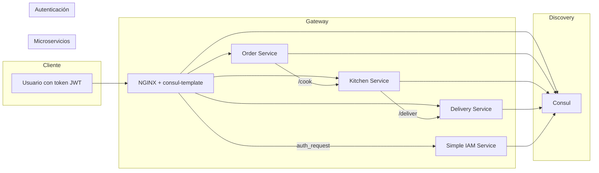

# 🧪 Microservicios de Restaurante con IAM y Service Discovery (Consul)

Este repositorio contiene un proyecto educativo para demostrar **una arquitectura moderna de microservicios**, integrando:

- ✅ Múltiples microservicios (`order`, `kitchen`, `delivery`)
- 🔐 Un sistema de autenticación (IAM) usando tokens
- 🔎 **Service Discovery** con Consul
- 🌐 API Gateway dinámico con `nginx` y `consul-template`
- ⚙️ Escalabilidad, seguridad y resiliencia

Ideal para enseñar los principios de **diseño de microservicios, descubrimiento de servicios, e integración de seguridad descentralizada**.

---

## 📊 Diagrama de arquitectura (Mermaid)



## 🗂️ Estructura del proyecto
```
.
├── docker-compose.yml
├── .env                       # Variables de entorno globales (como CONSUL_HOST)
├── gateway/                   # Contiene nginx.ctmpl y el Dockerfile con consul-template
│   ├── nginx.ctmpl            # Plantilla que se llena dinámicamente con Consul
│   └── start.sh               # Script que lanza nginx y consul-template
├── shared/                    # Dockerfile base para microservicios Flask
├── simple_iam/                # Microservicio de autenticación JWT
│   ├── app.py                 # Endpoints: /login, /validate, /ping
│   ├── utils.py               # Funciones para generar/verificar token
│   └── secrets.env            # Clave secreta para firmar tokens
├── order_service/             # Microservicio que recibe pedidos
│   └── app.py
├── kitchen_service/           # Microservicio que simula cocina
│   └── app.py
├── delivery_service/          # Microservicio que simula entrega
│   └── app.py
└── utils/consul.py            # Función compartida para registrar en Consul
```

## 🚀 Cómo ejecutar el sistema

1.	Asegúrate de tener Docker y Docker Compose instalados.
2.	Clona el repositorio:
   ```
    git clone https://github.com/tu_usuario/restaurant-microservices-demo.git
    cd restaurant-microservices-demo
   ```
4.	Levanta todos los servicios:
   ```
   docker compose up --build
   ```
5.	Abre el dashboard de Consul: http://localhost:8500
6.	Abre el gateway: http://localhost:8080/order/

## 🔐 Cómo probar autenticación

### Paso 1: Obtener un token válido
```
curl -X POST http://localhost:8080/login \
     -H "Content-Type: application/json" \
     -d '{"username": "joel", "password": "1234"}'
```
